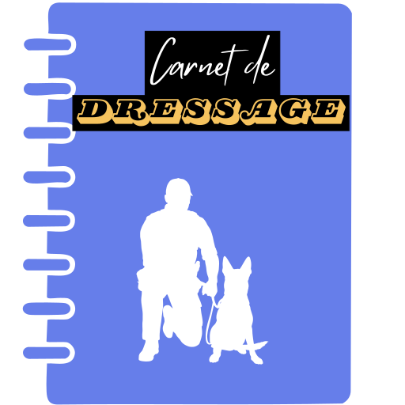

<p align="center">
  
</p>

<h1 align="center">🐕 Carnet de Dressage</h1>

<p align="center">
  <strong>Application de suivi de formation pour maître de chien</strong><br>
  <em>PWA moderne, 100% hors-ligne, données locales</em>
</p>

<p align="center">
  <a href="https://github.com/btlspace/carnet-dressage/blob/main/LICENSE">
    
  </a>
  <a href="https://monchien.berthel.me">
    
  </a>
  
  
  
</p>

<p align="center">
  &nbsp;&nbsp;
  &nbsp;&nbsp;
  
</p>

---

## 📋 Présentation

Le **Carnet de Dressage** est une application web progressive (PWA) conçue pour accompagner la formation et le suivi d'entraînement de votre chien de recherche. Tout est pensé pour une utilisation terrain : rapide, hors-ligne et centré sur vos fiches.

L'application propose trois types de fiches principales :

- 🔍 **Recherche de matière** — Suivi des séances de recherche (substances, poseurs, contextes, résultats).
- 🎓 **Obéissance** — Suivi des exercices d'obéissance et de la progression dans le temps.
- 📝 **Divers** — Notes libres, observations générales, points à travailler.

Les données sont stockées localement sur votre appareil (IndexedDB) et peuvent être exportées/importées à tout moment.

---

## ✨ Fonctionnalités principales

| Fonctionnalité | Description |
|----------------|-------------|
| 📱 **PWA Installable** | Installez l'app sur mobile ou desktop, utilisez-la hors-ligne |
| 💾 **Stockage local** | Toutes les données restent sur votre appareil (IndexedDB) |
| 🎲 **Ordre de passage** | Tirage au sort des binômes avec statistiques |
| 🖨️ **Impression** | Export PDF de toutes vos fiches |
| 📥 **Sauvegarde** | Export/import JSON de vos données |
| 🎨 **Interface moderne** | Design responsive et intuitif |

---

## 🚀 Démarrage rapide

### Utilisation en ligne

L'application est déjà déployée et utilisable en ligne à l'adresse suivante :

- https://monchien.berthel.me

Vous pouvez l'installer comme PWA directement depuis cette URL.

### Prérequis (développement local)

- Node.js 18+
- npm ou yarn

### Installation

```bash
# Cloner le dépôt
git clone https://github.com/btlspace/carnet-dressage.git
cd carnet-dressage

# Installer les dépendances
npm install

# Lancer en développement
npm run dev
```

L'application sera accessible sur [http://localhost:5173](http://localhost:5173)

### Build de production

```bash
npm run build
npm run preview
```

## 📁 Structure du projet

```text
carnet-dressage/
├── public/              # Assets statiques, manifest PWA, icônes, logo, screenshot
├── src/
│   ├── components/      # Composants React (Navbar, Footer, etc.)
│   ├── views/           # Pages/vues principales (Accueil, Fiches, Tirage, Réglages…)
│   ├── styles/          # Fichiers CSS organisés par vue/composant
│   ├── db.js            # Accès et structure IndexedDB (fiches, paramètres)
│   └── utils.js         # Fonctions utilitaires (toasts, helpers…)
└── .github/             # Config GitHub, instructions IA
```

## 🛠️ Technologies

- **React 18** — Interface utilisateur
- **Vite** — Outil de build et dev-server
- **React Router** — Navigation SPA sans rechargement de page
- **IndexedDB** — Stockage persistant 100% local
- **Vite PWA Plugin** — Service worker et manifest PWA

---

## 🤝 Contribuer

Les contributions sont les bienvenues pour améliorer l'application, corriger des bugs ou proposer de nouvelles idées.

1. 🍴 Forkez le projet
2. 🌿 Créez une branche (`git checkout -b feature/ma-fonctionnalite`)
3. 💾 Commitez vos changements (`git commit -m 'Ajout d'une fonctionnalité'`)
4. 📤 Pushez (`git push origin feature/ma-fonctionnalite`)
5. 🔃 Ouvrez une Pull Request

### Signaler un bug ou poser une question

- 🐛 [Ouvrir une issue](https://github.com/btlspace/carnet-dressage/issues)
- 💬 [Démarrer une discussion](https://github.com/btlspace/carnet-dressage/discussions)

## 📄 Licence

Ce projet est sous licence **Creative Commons Attribution-NonCommercial-ShareAlike 4.0 International** (CC BY-NC-SA 4.0).

Vous êtes libre de :
- **Partager** — copier et redistribuer le matériel
- **Adapter** — remixer, transformer et créer à partir du matériel

Sous les conditions suivantes :
- **Attribution** — Vous devez créditer l'auteur
- **Pas d'utilisation commerciale** — Vous ne pouvez pas utiliser le matériel à des fins commerciales
- **Partage dans les mêmes conditions** — Si vous remixez, transformez ou créez à partir du matériel, vous devez diffuser vos contributions sous la même licence

Voir le fichier [LICENSE](LICENSE) pour plus de détails.

---

<p align="center">
  Fait avec ❤️ par <a href="https://github.com/btlspace">@btlspace</a>
</p>
